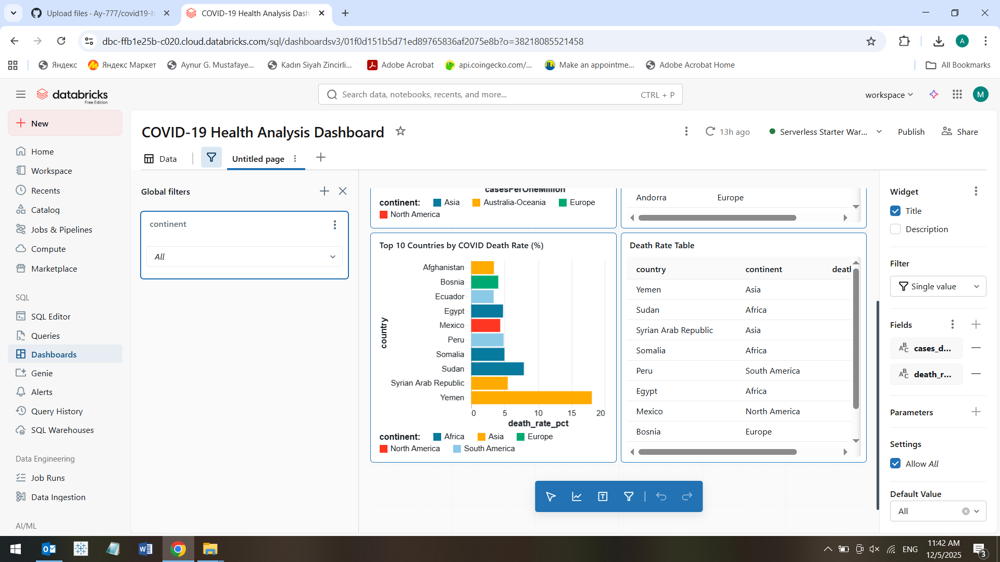
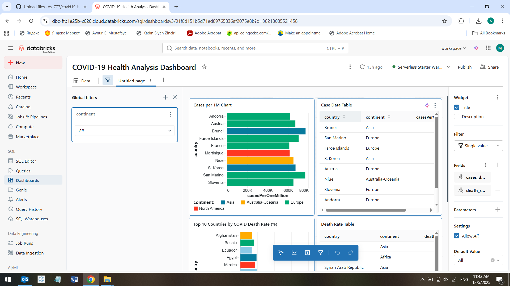
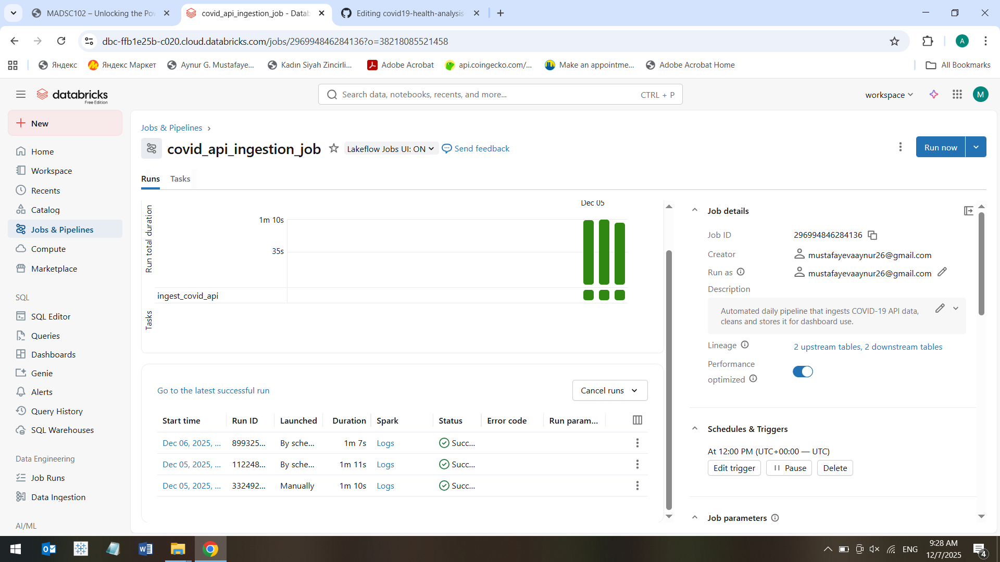

# COVID-19 Big Data Analysis – Databricks Project

Final exam project for MADSC102 – *Unlocking the Power of Big Data*  
This project demonstrates a full end-to-end big data workflow using **Databricks**, including:
- API data ingestion  
- PySpark data cleaning  
- Exploratory analysis  
- Interactive dashboard  
- Automated ingestion pipeline (Bonus)

---

## 1. Project Overview
The goal of this project is to collect global COVID-19 data from an external API, clean and transform it using PySpark, analyze key health indicators, and build an interactive dashboard to visualize the results.

Bonus: An automated **Databricks Job** pipeline runs daily to refresh the dataset.

---

## 2. Data Ingestion (01_ingest_covid_api)
The ingestion notebook:
- Calls the COVID-19 API  
- Loads JSON into a Spark DataFrame  
- Cleans and normalizes fields  
- Calculates metrics (cases per million, death rate %, etc.)  
- Stores final table in the Databricks Lakehouse

File included:  
✔ `01_ingest_covid_api.py`

---

## 3. Data Cleaning & Analysis (02_analysis_notebook)
This notebook performs:
- PySpark descriptive statistics  
- Ranking top high-risk countries  
- Correlation heatmap  
- Summary tables for dashboard use  

File included:  
✔ `02_analysis_notebook.py`

---

## 4. Interactive Dashboard
Dashboard features:
- Cases per 1M chart  
- Top 10 countries by COVID death rate (%)  
- Summary tables  
- A global **continent filter** that updates all widgets  

Export included:  
✔ `covid19_dashboard1.png`

✔ `covid19_dashboard2.png`

## 5. Automated Pipeline (Bonus)
A Databricks **Job** was created to automatically run the API ingestion every day.

Job features:
- Daily trigger at 12:00 UTC  
- Performance optimized cluster  
- Detailed run logs  
- Custom job description  

Screenshots included:  
 ✔ `job_schedule_details.png`

## 6. Repository Structure

covid19-health-analysis-databricks/
│
├── 01_ingest_covid_api # Notebook for API data ingestion
├── 02_analysis_notebook # Notebook for analysis & SQL queries
│
├── dashboards/
│ ├── covid19_dashboard.pdf # Exported final dashboard
│
├── screenshots/
│ ├── job_run_success.png
│ ├── job_schedule.png
│ ├── job_details.png
│
├── README.md # Project documentation

 7. Tools & Technologies
- Databricks  
- Python / PySpark  
- REST APIs  
- Delta Lake  
- Databricks SQL  
- Databricks Jobs (Workflows)

